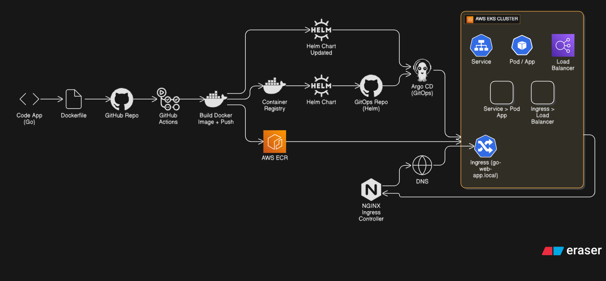
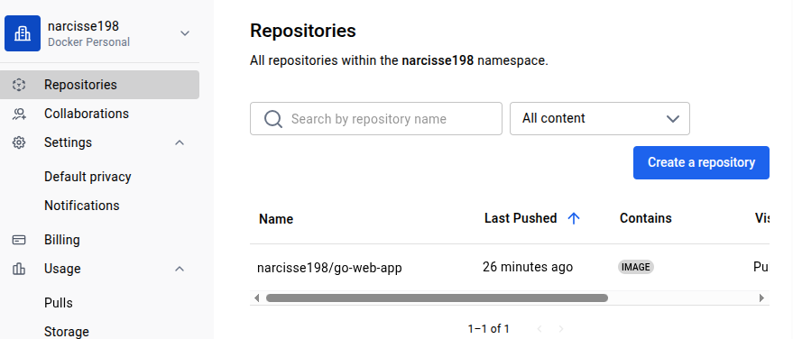
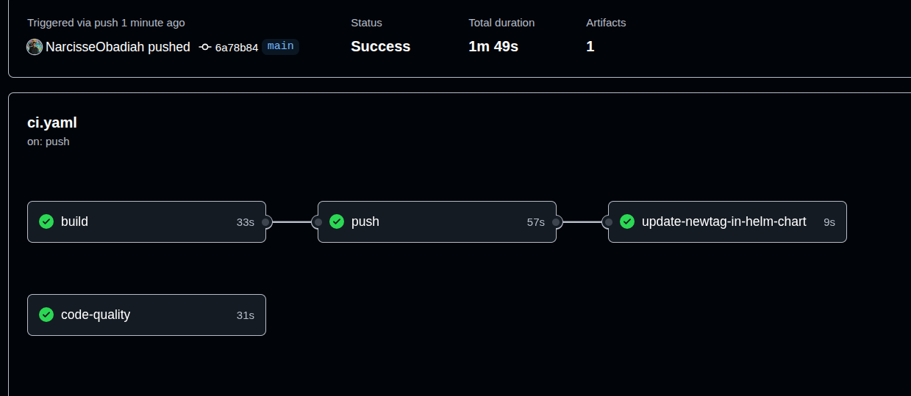
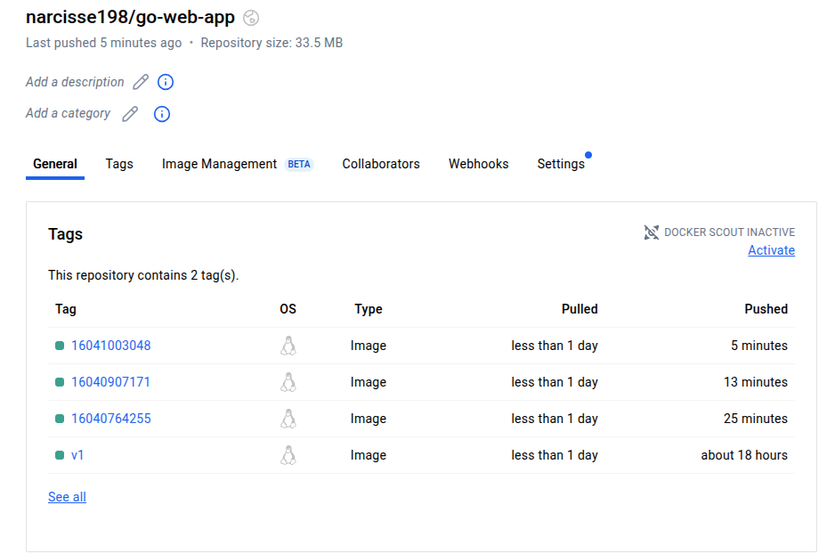
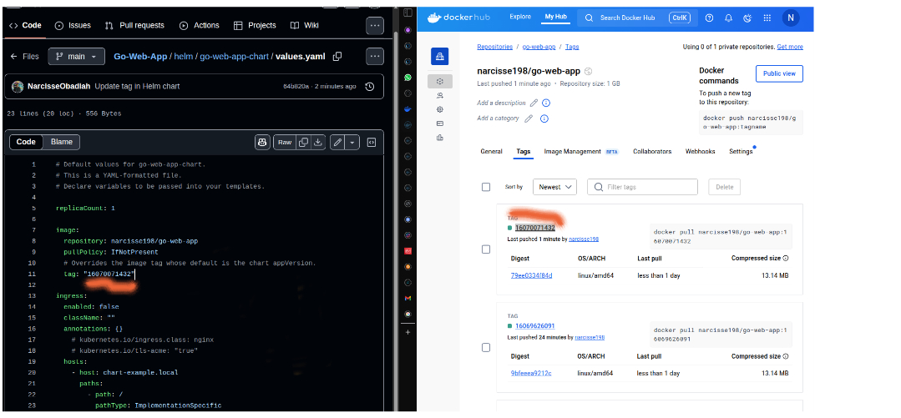
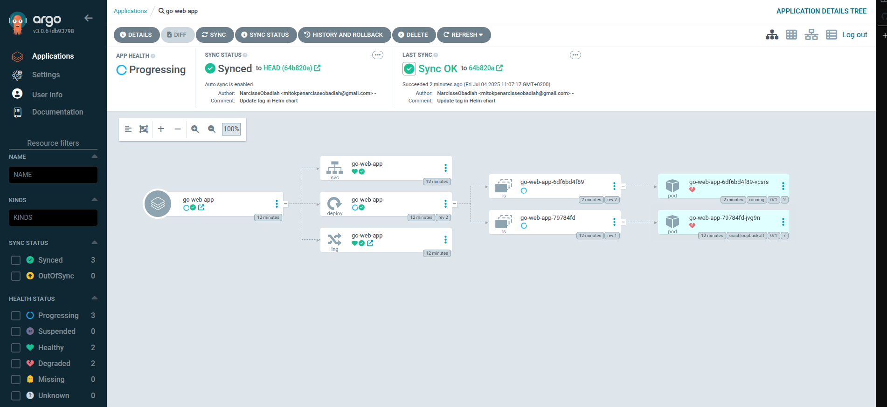
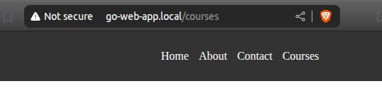
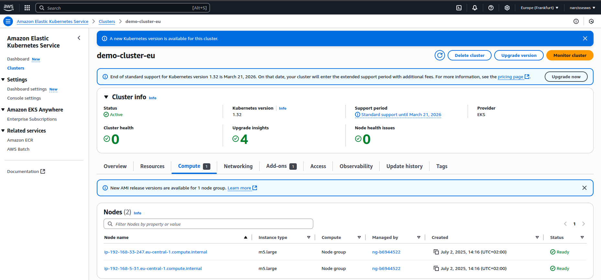
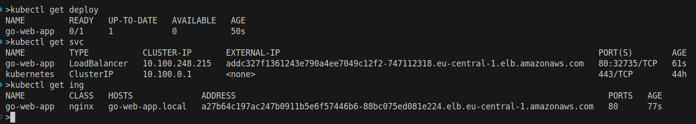

# 🌐 Go Web App Deployment on AWS EKS with GitOps & CI/CD

This project demonstrates a **complete, production-grade CI/CD pipeline** for deploying a Go web application to an AWS EKS Kubernetes cluster, fully automated via **GitHub Actions**, **Helm**, and **Argo CD** following GitOps best practices.



---

## 🚀 Tech Stack

- **Go (Golang)** – Web application
- **Docker** – Containerization
- **Helm** – Kubernetes manifest packaging
- **Kubernetes on AWS EKS** – Orchestration
- **NGINX Ingress Controller** – Traffic routing
- **GitHub Actions** – CI/CD automation
- **Argo CD** – GitOps deployment and synchronization
- **DockerHub** – Container image repository

---

---

## ✅ Prerequisites

- AWS account & EKS cluster configured
- Argo CD installed and accessible
- DockerHub or AWS ECR credentials for pushing images
- `kubectl`, `helm`, `argocd` CLI tools installed
- DNS record configured for your Ingress (e.g., `go-web-app.local`)

---

## 🔁 Complete End-to-End Workflow

### 1️⃣ Local Development & Testing

Develop your Go application:

```go
// main.go
package main

import (
	"log"
	"net/http"
)

func homePage(w http.ResponseWriter, r *http.Request) {
	// Render the home html page from static folder
	http.ServeFile(w, r, "static/home.html")
}
```

Build and test locally:

```bash
docker build -t narcisse198/go-web-app:latest .
docker run -p 8080:8080 narcisse198/go-web-app:latest
```
 DockerHub Image Registry :

---

### 2️⃣ Push to GitHub & Trigger CI/CD

On push to `main`, the CI/CD pipeline runs via GitHub Actions:

```yaml
# .github/workflows/ci.yml (simplified)
name: CI/CD

on:
  push:
    branches:
      - main

jobs:
  build-and-push:
    runs-on: ubuntu-latest
    steps:
      - uses: actions/checkout@v4
      - uses: actions/setup-go@v2
        with:
          go-version: 1.21.11
      - run: go build -o go-web-app
      - run: go test ./...
      - uses: docker/setup-buildx-action@v1
      - uses: docker/login-action@v3
        with:
          username: ${{ secrets.DOCKERHUB_USERNAME }}
          password: ${{ secrets.DOCKERHUB_TOKEN }}
      - uses: docker/build-push-action@v6
        with:
          context: .
          push: true
          tags: ${{ secrets.DOCKERHUB_USERNAME }}/go-web-app:${{ github.run_id }}
```

GitHub Actions workflow successful ➡️


DockerHub image pushed with tag ➡️  

---

### 3️⃣ Helm Chart for Kubernetes Deployment

The Helm chart deploys your app on EKS.

**values.yaml snippet:**

```yaml
image:
  repository: narcisse198/go-web-app
  tag: "<UPDATED BY CI/CD>"
```

Helm defines:

✅ Deployment  
✅ Service  
✅ Ingress  

Helm values updated with image tag ➡️ 


---
### 4️⃣ GitOps with Argo CD

Argo CD continuously monitors Git repository:

**argocd.yaml** (removed from the project)

```yaml
apiVersion: argoproj.io/v1alpha1
kind: Application
metadata:
  name: go-web-app
spec:
  source:
    repoURL: https://github.com/NarcisseObadiah/GO-Wep-App
    path: charts/go-web-app-chart
    targetRevision: HEAD
  destination:
    server: https://kubernetes.default.svc
    namespace: go-web-app
  syncPolicy:
    automated:
      prune: true
      selfHeal: true
```

Once your Helm values are updated by CI/CD, Argo CD automatically syncs the changes to EKS.

Argo CD UI showing app healthy & synced ➡️ 


---

### 5️⃣ Ingress & DNS Setup

Your service is exposed via NGINX Ingress:

```yaml
apiVersion: networking.k8s.io/v1
kind: Ingress
metadata:
  name: go-web-app
spec:
  ingressClassName: nginx
  rules:
  - host: go-web-app.local
    http:
      paths:
      - path: /
        pathType: Prefix
        backend:
          service:
            name: go-web-app
            port:
              number: 80
```

Update your DNS to point `go-web-app.local` to the EKS Load Balancer.

🖼** Browser accessing `go-web-app.local` ➡️

 
 
 **Our app onlive : 

🖼** EKS console with cluster running ➡️  


🖼️** Terminal output of `kubectl get deploy, kubectl get svc, kubectl get ingress` ➡️  



---

## 📈 Optional Enhancements

- ✅ Prometheus & Grafana for monitoring  
- ✅ Sealed Secrets or AWS Secrets Manager for secret management  
- ✅ Security scans with Trivy or Snyk  

---

## 👨‍💻 Author

**Narcisse Obadiah**  
Software Engineer | Cloud-Native Enthusiast

---

## 🎯 Final Notes

This project showcases:

✔️ Scalable Go app deployment on Kubernetes  
✔️ Full CI/CD pipeline with image building & Helm automation  
✔️ GitOps approach via Argo CD  
✔️ Clear, modular, production-grade structure  

